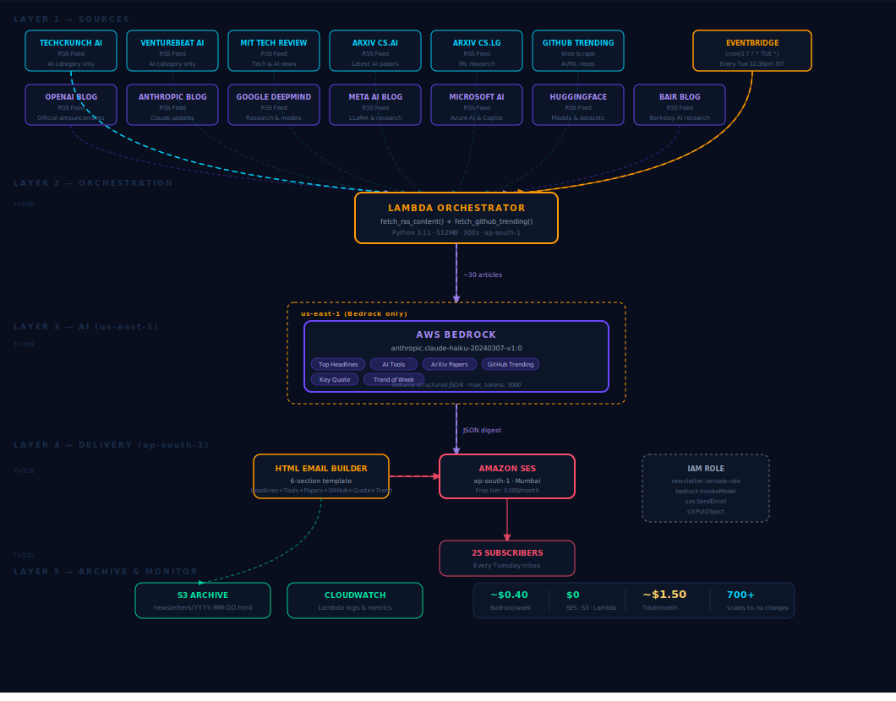

# 🚀 AI Newsletter Automation

A fully automated, serverless pipeline that aggregates, summarizes, and delivers AI news using LLMs — in under 20 seconds.

Built with AWS Lambda, Amazon Bedrock (Claude), SES, and S3.

---

## 📸 Sample Output

---

## 🚀 Project Highlights

* ⚙️ Fully automated AI newsletter pipeline (0 manual effort)
* 📰 Aggregates 10+ AI sources (news, blogs, research, GitHub)
* 🧠 Uses LLM (AWS Bedrock - Claude) for structured summarization
* 📧 Generates production-ready HTML emails
* ☁️ Sends via AWS SES and archives in S3
* ⏱ End-to-end runtime: ~10–20 seconds

---

## 🏗️ Architecture

### 🔄 Workflow

1. Fetch AI news from RSS feeds
2. Scrape trending GitHub repositories
3. Aggregate and clean content
4. Send data to LLM (Bedrock Claude)
5. Generate structured JSON summaries
6. Convert summaries into HTML newsletter
7. Send email via AWS SES
8. Archive output in S3

---

## 📊 Performance

* ⏱ Runtime: ~10–20 seconds
* 📰 Articles processed: 30–50 per run
* ⚙️ Fully automated (no manual effort)
* 📅 Can be scheduled via AWS EventBridge

---

## 🧠 Engineering Challenges Solved

* Handling inconsistent RSS feed formats
* Parsing structured JSON output from LLMs
* Deduplicating overlapping news sources
* Designing reliable serverless workflows
* Managing email formatting for readability

---

## 💡 Why This Project

Staying updated with AI advancements is time-consuming.

This system automates the entire workflow — from content discovery to summarization and delivery — saving hours of manual effort every week.

---

## ⚙️ Setup & Configuration

### 1. Clone the Repository

git clone https://github.com/selvankj/ai-newsletter-automation.git
cd ai-newsletter-automation

---

### 2. Install Dependencies

pip install -r requirements.txt

---

### 3. Configure Environment Variables

Set the following variables in AWS Lambda (or locally):

SENDER_EMAIL=[your-email@example.com](mailto:your-email@example.com)
RECIPIENT_EMAIL=[recipient@example.com](mailto:recipient@example.com)
S3_BUCKET=your-s3-bucket-name
AWS_REGION=your-region

---

### 4. Deploy to AWS Lambda

* Upload `lambda_function.py`
* Set environment variables
* Configure trigger (EventBridge for scheduling)

---

## ▶️ Usage

Run manually:

python lambda_function.py

Or schedule weekly using EventBridge.

---

## 📂 Project Structure

ai-newsletter-automation/
├── lambda_function.py
├── requirements.txt
├── README.md
├── newsletter-sample.png
├── ai_newsletter_architecture.svg

---

## 🔐 Notes

* Ensure AWS SES is out of sandbox for email delivery
* Verify sender and recipient emails
* Configure IAM roles with required permissions

---

## 💡 Impact

Reduces hours of manual AI news curation into seconds using intelligent automation.

---

## 🚀 Future Improvements

* Add personalization based on user preferences
* Store historical newsletters for analytics
* Build a web dashboard for viewing newsletters
* Integrate more AI sources (Twitter, Arxiv, etc.)

---

## 🤝 Contributing

Feel free to fork this repo and improve it!

---

## ⭐ If you like this project

Give it a star on GitHub ⭐
